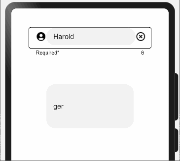

## 1. Introduction

A **Text-Field** is a space where users are allowed to type any text into the app. Text-fields allows user to implement various activities on the inserted text i.e. cut, copy, paste, auto-correction, validation etc. If you click on a text-field space, it will display the keyboard.

Below is an example of a Text-field:


Developers can add some other activities to this text-field - like error showing, all ok status with tick symbol, prefixes and suffixes etc.

## 2. Benefits

* Easier to customize.
* Error labels that display error messages when an error occurs.
* Character Counter.
* Password visibility toggle.

## 3. Typical UseCases:

MaterialText-Fields can be used in scenario like where data needs to be gathered from users like: forms, login page etc. Below are some of the examples:

 

## 4. List of Features:

There are few features of Radio buttons listed below:

|Features|Description|
|:-:|:-:|
|Labeled/Non-Labeled|Label can be enabled and disabled for the field.|
|Assistive Elements|Elements like Helper Text and Charactre counter can be implemented with the field|
|Leading and Trailing Icons|Icons can be added to help user to understand the type of input expected|
|Error Message assistance|to check and verify the type of input require|
|||

Please refer below Image: 


## 5. Exemplary Images:

### Defocused TextFields:

   

### Focused TextFields:

     
   

## 6. Install and Usage Instructions:

1. Add dependencies:

Add following to the dependencies in package.json file in entry folder of your project:

```            
{
    "dependencies": {
        "@ohos/materialtextfield": "file:../materialtextfield"
    }
}
```

2. Import files:

```
import { MaterialTextField, MaterialTextFieldOptions, MaterialTextFieldType } from "@ohos/MaterialTextField"
```

3. Usage:

```
import { MaterialTextField, MaterialTextFieldOptions, MaterialTextFieldType } from "@ohos/MaterialTextField"

@Entry
@Component
struct Outlined_sample {
  textFieldOptions: MaterialTextFieldOptions = new MaterialTextFieldOptions()
    .setIcons($r('app.media.account'), $r('app.media.clear'))
    .onTrailingIconClick((event) => {
      console.log("Trailing icon click:" + JSON.stringify(event))
    })
    .onLeadingIconClick((event) => {
      console.log("Leading icon click:" + event)
    })
    .setCharacterCounter(true, 10)
    .isValid((value) => {
      if (value.charAt(4) == 'd') {
        return { valid: true, errorMessage: '' }
      }
      else return { valid: false, errorMessage: 'd should be at 5th position' }
    })
    .setHelperText('Required*')
    .setTextInputOptions({
      placeholderText: 'mail or phone',
      input: 'Harold',
      caretColor: Color.Blue,
      fontFamily: 'cursive'
    })

  aboutToAppear() {

  }

  build() {
    Flex({
      direction: FlexDirection.Column,
      justifyContent: FlexAlign.SpaceAround,
      alignItems: ItemAlign.Center
    }) {
      MaterialTextField({
        textFieldParameters: this.textFieldOptions,
        textFieldType: MaterialTextFieldType.Outlined
      })
      TextInput({
        placeholder: 'he',
        text: 'ger'
      }).width('200vp').height('100vp').fontFamily('cursive')
    }
    .width('100%')
    .height('300vp')
    .backgroundColor(Color.White)
  }
}
```



## 7. APIs, Parameters, Options, Attributes and Events:

`MaterialTextField({textFieldType:MaterialTextFieldType,textFieldParameters:MaterialTextFieldOptions})`

### Parameters:

textFieldType: [MaterialTextFieldType](#materialtextfieldtype)

textFieldOptions: [MaterialTextFieldOptions](#materialtextfieldoptions)

### MaterialTextFieldOptions:

|Parameter|type|Remarks|
|-|-|-|
|label|string|label of textfield|
|leadingIcon|Resource|leading icon to be used|
|trailing icon|Resource|trailing icon to be used|
|characterCounter|boolean|characterCounter enabled when true|
|maxCharacters|number|max number of characters allowed|
|helperText|string|used as a hint for input text|
|textInputOptions|[Object{}](README.md#textinputoptions)|text input options|
|margin|Length or Padding|-|
|padding|Length or Padding|-|
|border|[BorderOptions](https://developer.harmonyos.com/en/docs/documentation/doc-references/ts-universal-attributes-border-0000001158261223)|-|
   
### MaterialTextFieldType

1. Filled
2. Outlined
    
### TextInputOptions
|Options|type|Remarks|
|-|-|-|
|id|string|id of textfield|
|input|string|input|
|placeholderText|string|placeholder of input field
|inputType|[InputType](https://developer.harmonyos.com/en/docs/documentation/doc-references/ts-basic-components-textinput-0000001233397495#EN-US_TOPIC_0000001233397495__li1018842194211)|select one of InputType
|placeholderFont|{ size?: Length, weight?:[FontWeight](https://developer.harmonyos.com/en/docs/documentation/doc-references/ts-universal-attributes-text-style-0000001111681086#EN-US_TOPIC_0000001111681086__li24391125115311), family?: string, style?: [FontStyle](https://developer.harmonyos.com/en/docs/documentation/doc-references/ts-universal-attributes-text-style-0000001111681086#EN-US_TOPIC_0000001111681086__li6906111945316)}|Font of placeholder|
|placeholderColor|Color|-|
|fontColor|Color|color of input text|
|fontSize|number|-|
|fontStyle|[FontStyle](https://developer.harmonyos.com/en/docs/documentation/doc-references/ts-universal-attributes-text-style-0000001111681086#EN-US_TOPIC_0000001111681086__li6906111945316)|-|
|fontWeight|[FontWeight](https://developer.harmonyos.com/en/docs/documentation/doc-references/ts-universal-attributes-text-style-0000001111681086#EN-US_TOPIC_0000001111681086__li24391125115311)|-|
|fontFamily|string|-|
|enterKeyType|[EnterKeyType](https://developer.harmonyos.com/en/docs/documentation/doc-references/ts-basic-components-textinput-0000001233397495#EN-US_TOPIC_0000001233397495__li1231618102427)|enter key functionality|
|caretColor|Color|color of cursor when input is being edited|
   
### Atrributes:

The following attributes are supported for TextFieldOptions:

|Attribute|Description|
|-|-|
|`setTextFIeldType(type:MaterialTextFieldType)`|sets textfield type|
|`setLabel(label:string,labelWidth:number)`|sets the label for textfield|
|`setHelperText(text:string`)|sets the helper text|
|`setCharacterCounter(enable:boolean,maxCharacters:number)`|enables character counter and maximum allowed characters|
|`setIcons(leadingIcon:Resource,trailingIcon:Resource)`|sets leading and trailing icons|
|`setTextInputOptions(textInputOptions:TextInputOptions)`|sets the input text options|
|`setMargin(margin:Length or Padding)`|sets the margin for textfield|
|`setPadding(padding:Length or Padding)`|sets the padding for textfield|
|`setBorder(options:BorderOptions)`|sets the border parameters for textfield|

### Events:
|Event|Description|
|-|-|
|onLeadingIconClick(callBack:(event:[ClickEvent](https://developer.harmonyos.com/en/docs/documentation/doc-references/ts-universal-events-click-0000001111581270#EN-US_TOPIC_0000001111581270__li155675712535))=>void)|triggered when leading icon is being clicked|
|onTrailingIconClick(callBack:(event:[ClickEvent](https://developer.harmonyos.com/en/docs/documentation/doc-references/ts-universal-events-click-0000001111581270#EN-US_TOPIC_0000001111581270__li155675712535))=>void)|triggered when trailing icon is being clicked|
|onChange(callBack:(event:value?:string=>void)|triggered when textfield input changes|
|onSubmit(callBack:(enterKey?:[EnterKeyType](https://developer.harmonyos.com/en/docs/documentation/doc-references/ts-basic-components-textinput-0000001233397495#EN-US_TOPIC_0000001233397495__li1231618102427))=>void)|triggered when input of textfield is submitted|
|onEditChange(callBack:(isEditing:boolean)=>void)|triggered when user stops editing|
|isValid(callback:(value?:string)=>{})|triggered when user stops editing, should return an object of type: { valid:boolean,errorMessage:string}|

## 8. Library Features:

### Feature-1: 

***Description:*** User can define the type of textfield: *Filled* or *Outlined*.

***Code Snippet:***

```
build() {
    Flex({
      ...
    }) {
      Text('Filled and Labeled').fontSize('15fp').padding('5fp')
      MaterialTextField({
        textFieldParameters: this.filledLabelParas,
        textFieldType: MaterialTextFieldType.Filled
      });
      Text('Outlined and Labeled').fontSize('15fp').margin({ top: '40vp' })
      MaterialTextField({
        textFieldParameters: this.outlinedLabelParas,
        textFieldType: MaterialTextFieldType.Outlined
      });
    }.width('100%')
  }
```

***Screenshot:***


<br>

### Feature-2: 

***Description:*** User can insert Label for the textfields.

***Code Snippet:***

`outlinedLabelParas = new TextFieldOptions.setLabel(‘User’);`

or,

```
outlinedLabelParas: MaterialTextFieldOptions = new MaterialTextFieldOptions;

aboutToAppear(): void {
    this.outlinedLabelParas = {
      ...this.outlinedLabelParas,
      label: 'User',
      .
      .
      .
    }
}
```

***Screenshot:***


### Feature-3: 

***Description:*** User can insert trailing and leading icons and  bind other on-click features like drop down menu and date picker with these icons.

***Code Snippet:***

`outlinedLabelParas = new TextFieldOptions.setLabel(‘User’);`

or,

```
outlinedLabelParas: MaterialTextFieldOptions = new MaterialTextFieldOptions;

aboutToAppear(): void {
    this.outlinedLabelParas = {
      ...this.outlinedLabelParas,
      label: 'User',
      ...
    }
}
```

***Screenshot:***


## 8. Conclusion:
This library is for using toggle switches that can be customized based on colors, an icon passed by the user and also be set to disabled or On/Off state.

## 9. Code Contribution:
If you find any problems during usage, you can submit an [Issue](https://github.com/Applib-OpenHarmony/MaterialSwitch/issues) to us. Of course, we also welcome you to send us [PR](https://github.com/Applib-OpenHarmony/MaterialSwitch/pulls).
